# expert-link

## Краткое описание проекта
expert-link — децентрализованная система связи (мессенджер) на Kotlin Multiplatform. Каждый экземпляр приложения содержит встроенный mesh-узел, который обнаруживает другие узлы в локальной сети и обменивается зашифрованными пакетами напрямую без центрального сервера. Сценарий использования — локальные/закрытые сети и аварийные режимы, когда интернет или централизованные сервисы недоступны.

Проект включает backend-ядро mesh-узла, публичный контракт API и клиентские хост-модули (Desktop/Android UI, CLI, simulator).

## Соответствие ТЗ
| Требование ТЗ | Статус | Фактическая реализация в коде |
| --- | --- | --- |
| Обнаружение узлов | Реализовано | UDP multicast + broadcast fallback (`UdpDiscoveryAdapter`), API `announcePresence`, `discoverPeer`, `nearbyPeers`. |
| P2P-сессия | Реализовано | Pairing по invite с доверенным состоянием (`createPairingInvite`, `pairWithInvite`). |
| Текстовые сообщения | Реализовано | Шифрованные direct и group чаты, ACK, статусы доставки, треды (`ChatMessagingService`, `GroupChatService`, `ThreadService`). |
| Мультихоп | Реализовано | Relay/Flood пересылка пакетов с TTL и hopCount (`RelayService`, `RoutingService`, `RouteMode.RELAY_FLOOD`). |
| Передача файлов | Частично | Протокол offer/accept/chunk/ack/complete, SHA‑256, resume. Ограничение нагрузки — только последовательная отправка и размер чанка, нет явного лимита скорости/параллелизма. |
| Real‑time коммуникация | Частично | Signaling реализован в backend, WebRTC media есть на Android и Desktop. Нет отдельной методики/стендов измерений потерь и задержек, в simulator media не подключён. |
| Топология | Реализовано | `TopologyStateService`: host election, route health, connectivity mode, relay mode. |
| Реакция на разрывы | Реализовано (базово) | Инвалидация маршрутов при исчерпании ретраев, failover хоста, деградация route health. |
| Дедупликация / Ack / ретраи | Реализовано | `packetId` dedup, `DELIVERY_ACK` для чатов, очередь и планировщик повторов (`RetrySchedulerService`). Для файлов — chunk ACK и resume. |
| Безопасность | Реализовано (базово) | Шифрование payload (AES‑GCM + RSA), подпись метаданных, pairing trust, block list, rate limit. |
| Диагностика и метрики | Реализовано | Event log, метрики, topology snapshot, media stats. |

## Архитектура проекта
### Модули
- `contract` — публичный API (`MeshNode`) и DTO.
- `backend` — публичный facade, запускающий mesh-узел и скрывающий внутренние слои.
- `backend:data` — доменные модели и port-интерфейсы.
- `backend:application` — use‑case сервисы.
- `backend:infra` — реализации портов: UDP discovery, HTTP transport, crypto, in‑memory storage, chunk storage, relay stub.
- `backend:runtime` — bootstrap, Ktor server и controller для входящих пакетов.
- `composeApp` — KMP клиент (UI) для Desktop и Android через `AppPlatformServices`.
- `simulator` — сценарии через публичный API `MeshNode`.
- `bootstrap` — CLI host для запуска узла по JSON‑конфигу.

### Слои backend
- `controller` принимает входящий `PacketEnvelope` по HTTP.
- `application` обрабатывает use‑case (pairing, messaging, files, calls).
- `domain` описывает модели и порты.
- `infrastructure` реализует транспорт, discovery, storage, crypto.

### Ключевые точки входа
- `MeshBackend.launch(config, mediaEngine, multicastSupport)` — запуск узла.
- `MeshNode` — публичный контракт узла.
- `MeshNodeCli` (`bootstrap`) — headless запуск по JSON.

### Схема модулей
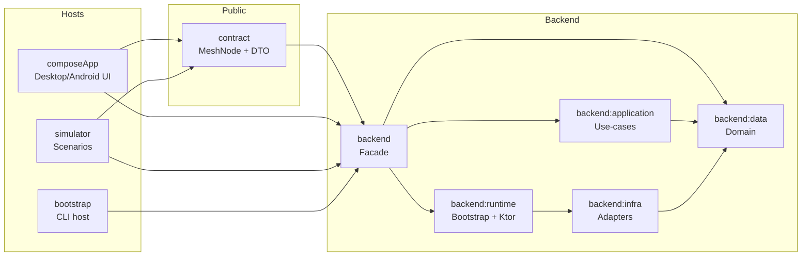

### Поток входящего пакета
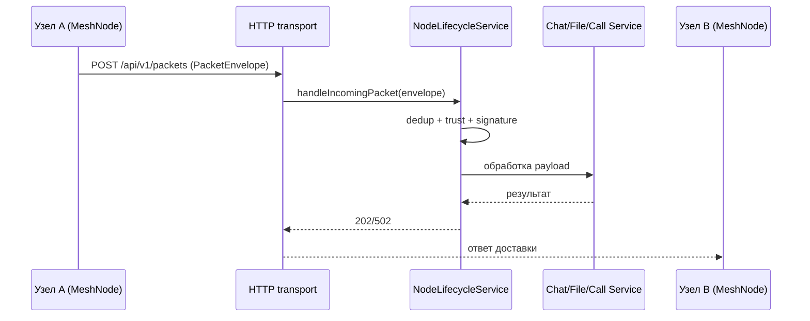

### Поток звонка (signaling + media)
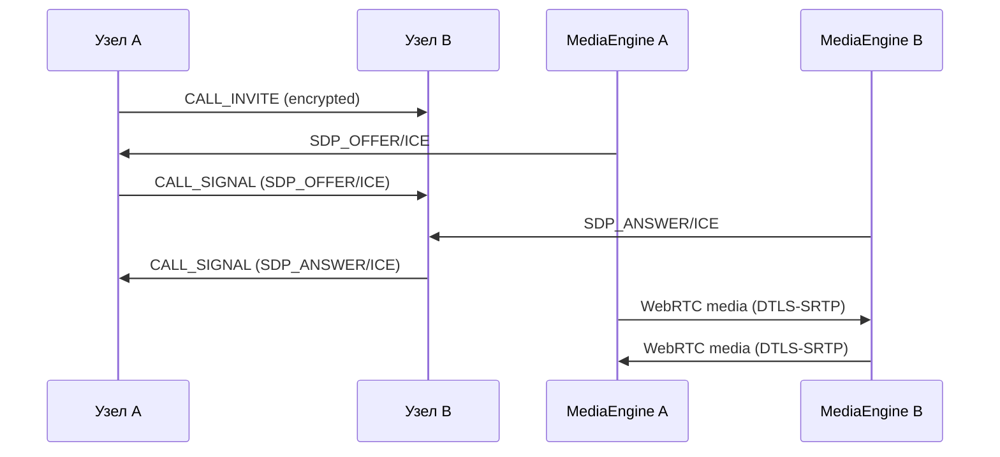

### Поток передачи файла
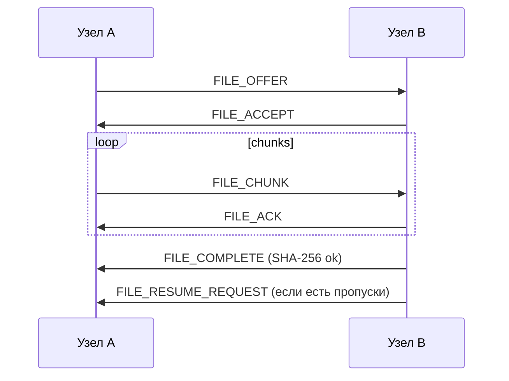

## Основные сценарии работы
### Запуск узла
1. Создать конфиг `MeshNodeConfig` или использовать `AppPlatformServices.defaultConfig()`.
2. Запустить `MeshBackend.launch(...)` или UI‑клиент (`composeApp`).
3. Проверить `MeshNode.profile` и `MeshNode.endpoint`.

### Обнаружение узлов
1. Включить discovery в конфиге (`featureFlags.discoveryEnabled = true`).
2. На каждом узле вызвать `announcePresence()`.
3. Прицельно искать peer через `discoverPeer(peerId)`.
4. Отобразить `nearbyPeers()`, `routes()` и `routingPlan(peerId)`.

### Сопряжение / invite / QR / trust
1. Узел A создаёт invite: `createPairingInvite()`.
2. Узел B принимает invite: `pairWithInvite(invite)`.
3. В UI: invite можно показать в виде QR, на Android доступно сканирование.
4. После pairing узлы переходят в `TrustState.TRUSTED` и могут обмениваться сообщениями/файлами/звонками.

### Отправка сообщений
1. Открыть диалог `openConversation(peerId)` или создать группу `createGroupChat`.
2. Отправить `sendChat(...)` или `sendMessage(...)`.
3. История: `messages(conversationId)` или `groupMessages(chatId)`.
4. Подтверждения доставки: `messageReceipts()`.

### Маршрутизация / relay / multihop
1. Обеспечить цепочку A‑B‑C через discovery или `rememberPeerEndpoint`.
2. Удалить прямой маршрут A‑C: `forgetPeerEndpoint(peerId)`.
3. Отправить сообщение на C с узла A.
4. Проверить `routingPlan(peerId)` и `routes()` для подтверждения multihop.

### Передача файлов
1. Узлы должны быть доверенными (pairing).
2. Запустить `sendFile(MeshFileTransferCommand)`.
3. Отслеживать `fileTransfers()` и статусы.
4. При необходимости вызвать `resumeFileTransfer(transferId)` или `cancelFileTransfer(transferId)`.

### Звонки
1. Узлы должны быть доверенными.
2. Запустить `startAudioCall` или `startVideoCall` (есть также групповые).
3. На принимающей стороне — `observeIncomingCalls()`, затем `acceptCall` или `rejectCall`.
4. Состояния и метрики: `observeMediaState(callId)` и `observeMediaStats(callId)`.

### Диагностика
1. Логи: `recentEvents(limit)`.
2. Метрики: `metrics()`.
3. Сеть и топология: `observeTopologyState()`, `inspectRouteHealth()`.

## Надёжность
- `PacketEnvelope` содержит `packetId`, `messageId`, `ttl`, `hopCount`.
- Dedup по `packetId` (`DeduplicationService`, retention по времени).
- ACK для чатов (`DELIVERY_ACK`) с обновлением `MessageDeliveryStatus`.
- Очередь исходящих пакетов и ретраи (`OutgoingQueuePort`, `PendingAckRepositoryPort`, `RetrySchedulerService`).
- Инвалидация маршрутов при исчерпании ретраев (`RoutingService.invalidateRoute`).
- Обновление route health и failover хоста (`TopologyStateService`).

## Передача файлов
- Протокол: `FILE_OFFER` → `FILE_ACCEPT` → `FILE_CHUNK` → `FILE_ACK` → `FILE_COMPLETE`.
- Чанки фиксированного размера (`fileTransfer.chunkSizeBytes`, по умолчанию 65 536).
- SHA‑256 файла проверяется на стороне получателя после сборки. Хеш каждого чанка передаётся в payload, но не проверяется.
- Resume: получатель вычисляет недостающие чанки и отправляет `FILE_RESUME_REQUEST`.
- Ограничение нагрузки: одна последовательная отправка чанков, без отдельного лимита скорости и параллелизма.

## Звонки / real‑time
- Signaling реализован в backend через `CALL_INVITE`, `CALL_SIGNAL`, `CALL_HANGUP`.
- Media: WebRTC engine подключается через `MeshMediaEngine`.
- Android использует `org.webrtc` и STUN `stun:stun.l.google.com:19302`.
- Desktop использует `dev.onvoid.webrtc` и тот же STUN.
- Метрики media: RTT, потери, jitter, битрейты (`observeMediaStats`).
- В simulator media не подключён (NoopMediaEngineAdapter), доступен только signaling и состояния.

## Безопасность
- Идентичность узла: `peerId = SHA‑256(publicKey)`.
- Pairing по invite с TTL и nonce защищает от replay.
- Payload‑шифрование: AES‑GCM, ключ защищён RSA‑OAEP.
- Подпись метаданных пакета (`PacketSignatureService`).
- Trust model: доступ к чату/файлам/звонкам только для TRUSTED peers.
- Anti‑spam: rate‑limit и block list.

## Запуск проекта
### Требования
- JDK 17.
- Для Android: Android SDK и Android Studio.

### Сборка
```bash
./gradlew build
```

### Тесты
```bash
./gradlew test
```

### Simulator (all scenarios)
```bash
./gradlew :simulator:run
```

### Desktop UI
```bash
./gradlew :composeApp:run --args="--name=Алиса --http=18100"
./gradlew :composeApp:run --args="--name=Боб --http=18101"
```

### CLI host (bootstrap)
1. Создайте `config.json` по `MeshNodeConfig`.
2. Запустите:
```bash
./gradlew :bootstrap:run --args="config.json"
```

Пример `config.json`:
```json
{
  "displayName": "node-1",
  "bindHost": "0.0.0.0",
  "httpPort": 18100,
  "discoveryPort": 19100,
  "multicastGroup": "239.60.60.60",
  "featureFlags": {
    "discoveryEnabled": true,
    "relayEnabled": true,
    "inMemoryTransport": false,
    "inMemoryDiscovery": false
  },
  "retry": { "pollIntervalMillis": 1000 },
  "fileTransfer": { "chunkSizeBytes": 65536, "downloadDirectory": "build/secure-mesh/downloads" },
  "relay": { "enabled": true, "forceRelayLookup": false, "relayEligible": true },
  "capabilities": ["chat", "file", "call"],
  "staticPeers": []
}
```

## Эксплуатация
- Включение discovery: `featureFlags.discoveryEnabled = true`.
- Режим in‑memory (локальные демонстрации): `featureFlags.inMemoryTransport = true`, `featureFlags.inMemoryDiscovery = true`.
- Relay‑режим: `relay.enabled`, `relay.forceRelayLookup`, `relay.relayEligible`.
- Параметры файлов: `fileTransfer.chunkSizeBytes`, `fileTransfer.downloadDirectory`.
- Ручные endpoint‑подсказки: `rememberPeerEndpoint(peerId, endpoint)` и `forgetPeerEndpoint(peerId)`.
- Если `bindHost` равен `0.0.0.0` или `localhost`, узел объявляет в discovery первый приватный IPv4‑адрес.

## Демонстрационные сценарии
### Simulator
Запуск `./gradlew :simulator:run` выполняет последовательность сценариев:

| Сценарий | Что демонстрирует |
| --- | --- |
| `DiscoveryDemoScenario` | Discovery, список соседей, маршруты и routing plan. |
| `PairingDemoScenario` | Pairing по invite и доверие. |
| `MessagingDemoScenario` | Direct‑чат, ACK. |
| `GroupThreadDemoScenario` | Группы и треды. |
| `RoutingDemoScenario` | Multihop и relay readiness. |
| `TopologyDemoScenario` | Topology snapshot, route health, host role. |
| `FileTransferDemoScenario` | Передача файлов, resume, cancel. |
| `CallDemoScenario` | Signaling звонков и call‑lifecycle. |
| `DiagnosticsDemoScenario` | Event log и метрики. |

### UI‑демонстрация (Desktop/Android)
1. Запустить два узла (Desktop или Android).
2. На одном узле создать invite и передать на другой (QR или строка).
3. Проверить `Nearby` и `Pairing` экраны: discovery + trusted peers.
4. Отправить сообщение в `Chats` и проверить ACK.
5. Для multihop запустить три узла и удалить прямой маршрут через `Nearby` → `forgetPeerEndpoint`.
6. Передать файл через экран `Transfers`.
7. Запустить звонок через экран `Calls`, проверить media stats.
8. Открыть `Diagnostics` и показать логи/метрики/топологию.

 Версия № 1
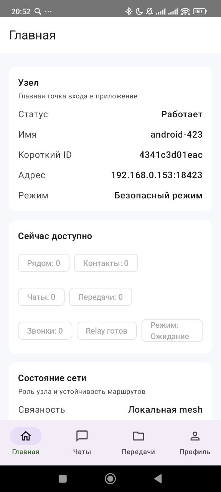
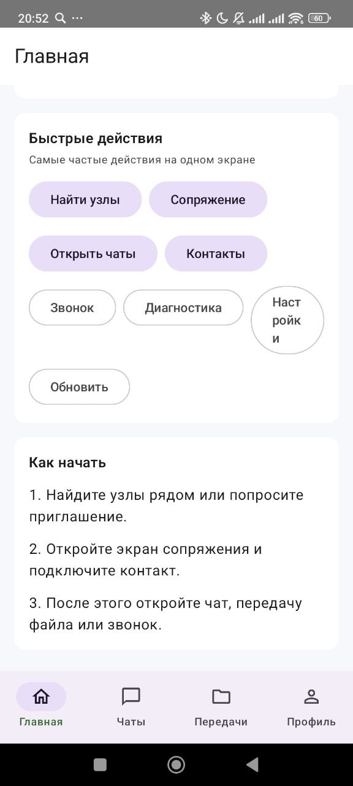
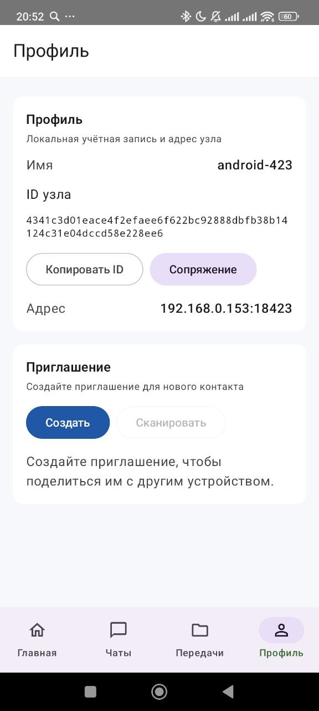
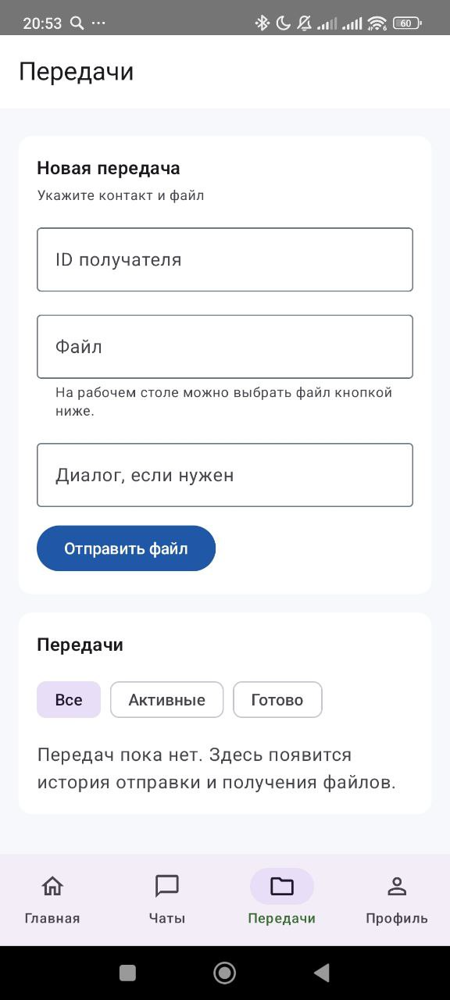
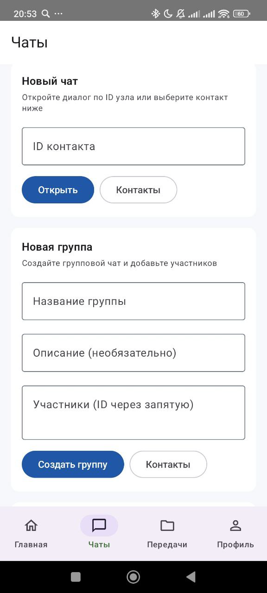

Версия №2

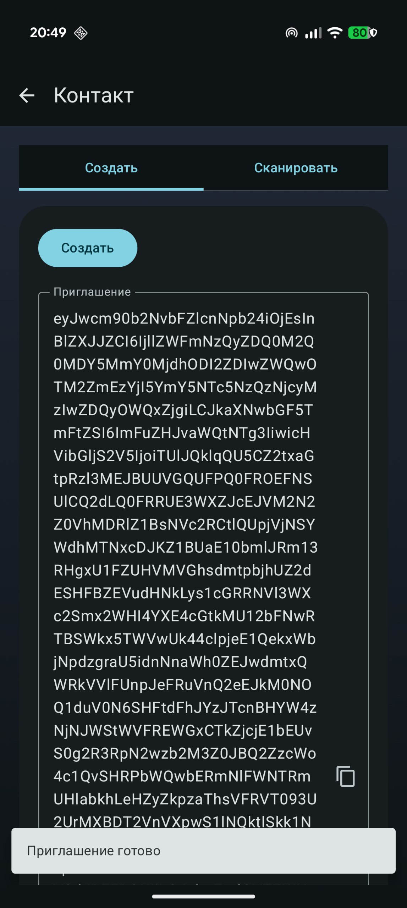
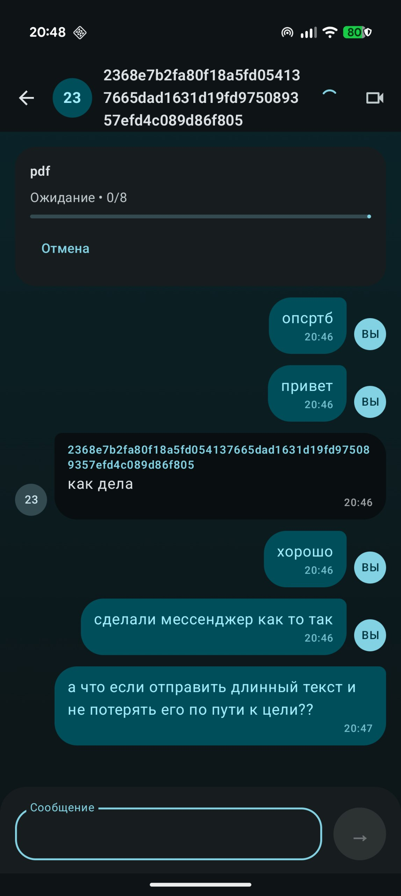
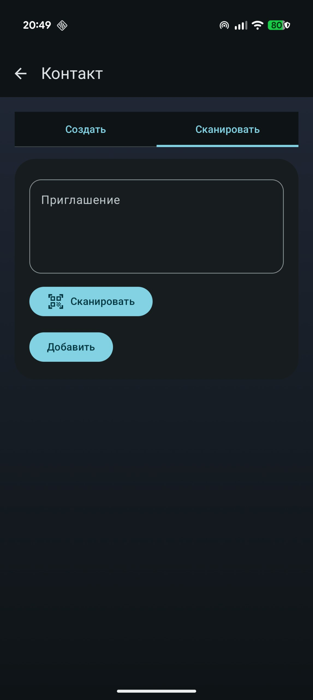
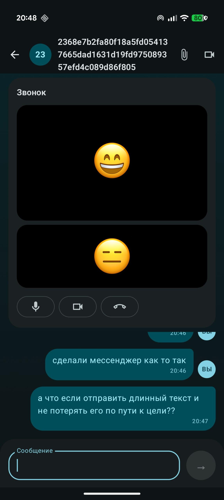
## Ограничения текущей реализации
- Все репозитории в runtime — in‑memory; состояние теряется при перезапуске.
- `RendezvousRelayClient` — in‑memory stub, внешнего relay‑сервера нет.
- Нет Wi‑Fi Direct/BLE; транспорт — HTTP, discovery — UDP multicast/broadcast.
- File transfer не имеет явного троттлинга; `PAUSED` в модели не используется; хеш чанка не проверяется.
- На Android отсутствует файловый picker, на Desktop нет QR‑сканирования.
- Для звонков нет отдельного стенда измерения потерь/задержек; доступны только live‑метрики.

## Документация
- `docs/architecture.md` — архитектурное описание.
- `docs/spec.md` — фактические сценарии backend.
- `docs/mobile-usage.md` — примеры использования `MeshNode`.
- `docs/kmp-readiness.md` — распределение common/jvm частей.
