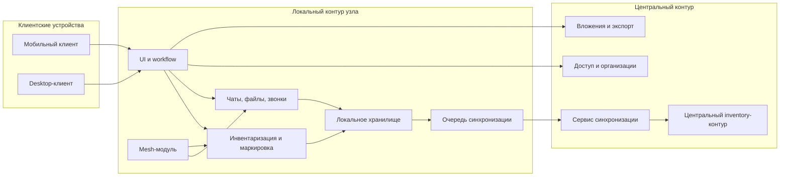
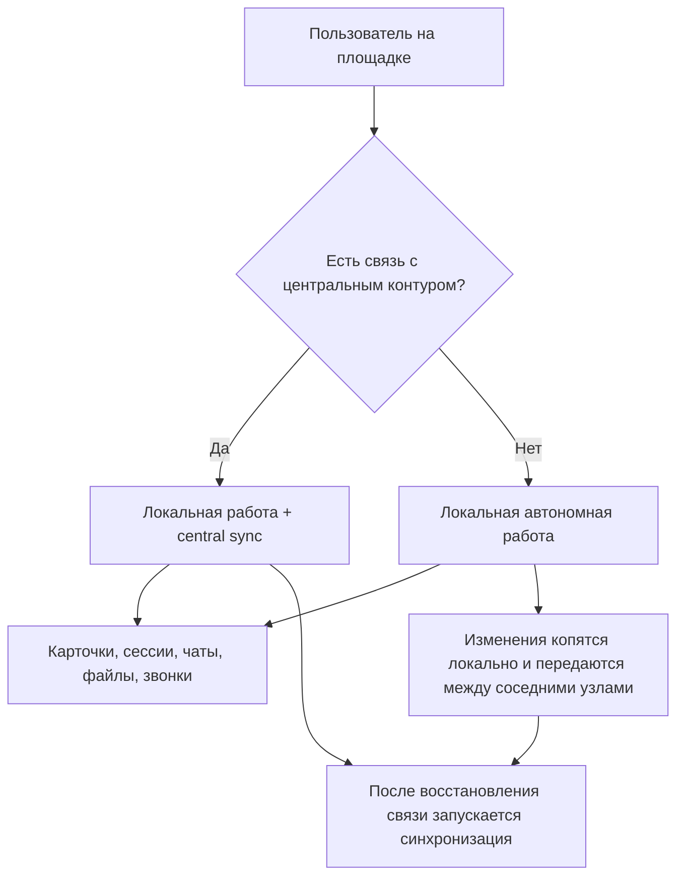
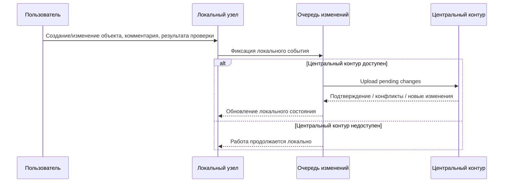
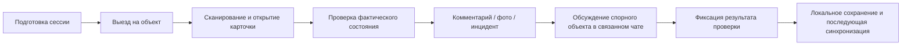
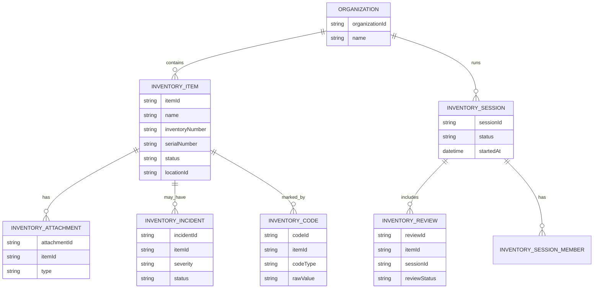
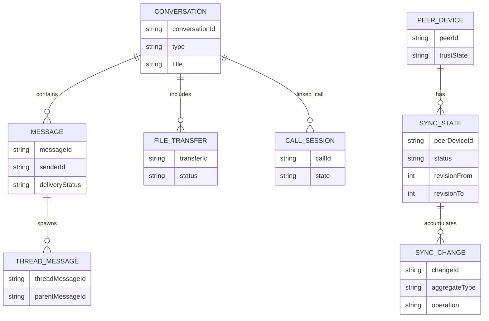
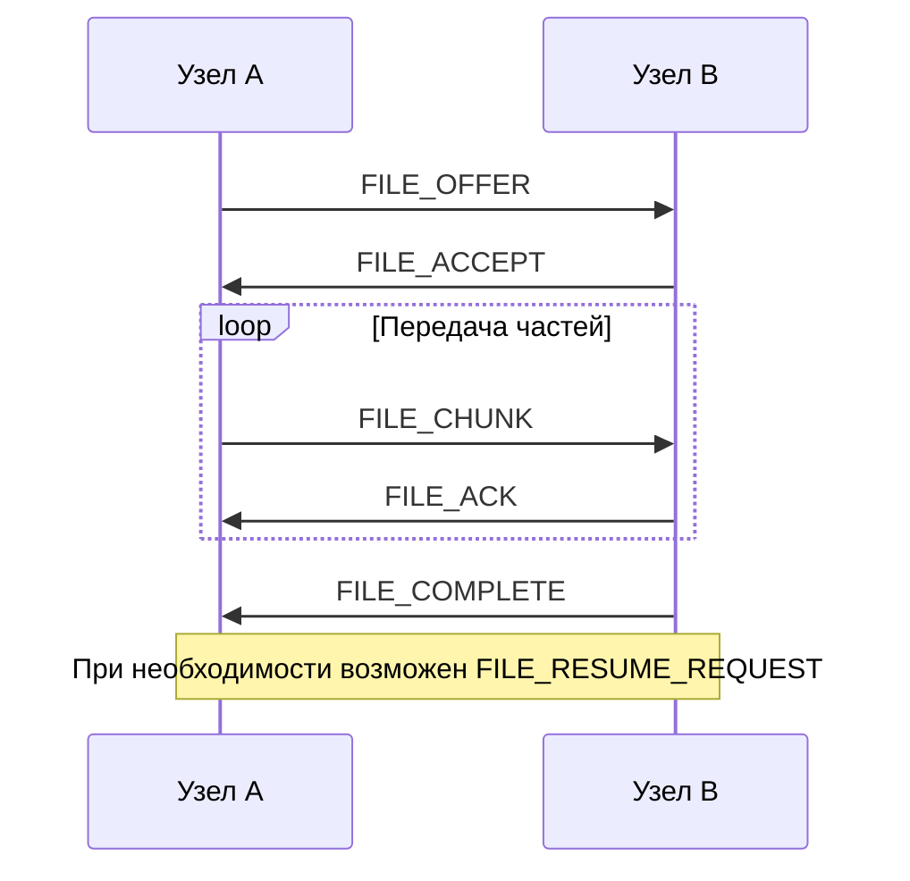

# Приложения, схемы и диаграммы

## Перечень рекомендуемых приложений

### Приложение 1. Компонентная архитектура
Использовать в технической презентации и пояснительной записке.

### Приложение 2. Режимы работы online/offline
Использовать в бизнесовой и технической презентации.

### Приложение 3. Сценарий синхронизации
Использовать в пояснительной записке и технической презентации.

### Приложение 4. Сценарий работы комиссии
Использовать в бизнесовой презентации.

### Приложение 5. Верхнеуровневая ER-модель предметного контура
Использовать в технической презентации как укрупнение существующей ER-диаграммы.

### Приложение 6. Верхнеуровневая ER-модель коммуникаций и синхронизации
Использовать в технической презентации как укрупнение существующей ER-диаграммы.

### Приложение 7. Схема передачи файлов и коммуникаций
Использовать в технической презентации.

## Какие реальные иллюстрации уже есть

### Из бизнесовой презентации
- Титульный слайд и блок общей информации.
- Сравнение с аналогами.
- Скриншоты desktop-прототипа.

### Из технической презентации
- Компонентная архитектура.
- ER-диаграмма inventory.
- ER-диаграмма мессенджера, файлов, звонков и синхронизации.
- Последовательности по пакетам, звонкам и файлам.
- Набор экранов desktop inventory-клиента.

### Из репозитория
- [docs/11.jpg](/home/itech/IdeaProjects/expert-link/docs/11.jpg) - desktop экран профиля узла
- [docs/img.png](/home/itech/IdeaProjects/expert-link/docs/img.png) - mobile главный экран
- [docs/img_3.png](/home/itech/IdeaProjects/expert-link/docs/img_3.png) - mobile экран передач
- [docs/img_4.png](/home/itech/IdeaProjects/expert-link/docs/img_4.png) - mobile экран чатов
- [docs/10.jpg](/home/itech/IdeaProjects/expert-link/docs/10.jpg) - mobile сканирование приглашения
- [docs/9.jpg](/home/itech/IdeaProjects/expert-link/docs/9.jpg) - mobile экран звонка

## Рекомендуемый порядок приложений в финальном PDF
- Приложение А. Компонентная архитектура
- Приложение Б. Режимы работы online/offline
- Приложение В. Сценарий синхронизации
- Приложение Г. Сценарий работы комиссии
- Приложение Д. Верхнеуровневая ER-модель предметного контура
- Приложение Е. Верхнеуровневая ER-модель коммуникаций и синхронизации
- Приложение Ж. Реальные экраны прототипа
